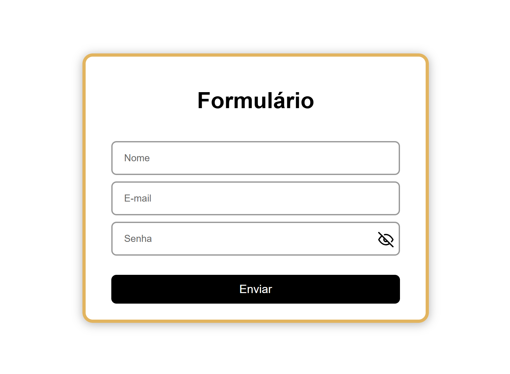

# 1 HTML + CSS

Foi criado um formulátio básico utilizando somente HTML CSS e JavaScript para captar eventos e fazer pequenas mudanças no formulário.

## Estilização
A estilização foi feita no arquivo styles.css e importada para o arquivo principal por meio da tag `link`

A estilização foi feita baseando-se nas cores da empresa (Branco, Preto e Laranja / Amarelo)

Foi criado nomes personalizados no HTML com o uso do atributo `class` para apontar os elementos estilizados no arquivo styles.css.

Foi muito utlizado também pseudoclasses como `:hover` e `:focused` e `:active` para deixar os estilos mais dinâmicos e amigáveis.

## Script.js
Esse arquivo foi criado para simular o envio do formulário e, também, personalizar o input da senha de forma a ter um ícone que mostra/esconde a senha quando pressionado.

Foi utilizado funções clássicas do javascript para selecionar elementos HTML, performar atualizações de variáveis e, também, trocar os os valores de um elemento HTML:
```bash
querySelector(): 

getElementById():

```

```bash
addEventListener():
```

```bash
elemento.innerHTML = novo valor
```

## Como Rodar o Projeto ?

O projeto pode ser executado das seguintes formas:

**Usando VS Code:**
- Instale a extensão "Live Server"
- Clique com o botão direito no `index.html`
- Selecione "Open with Live Server"

**Usando Node.js (npx):**
- Execute o seguinte comando no terminal: npx http-server


## Resultado Final
<table align="center">
  <tr>
    <td align="center">
      
    </td>
  </tr>
</table>


