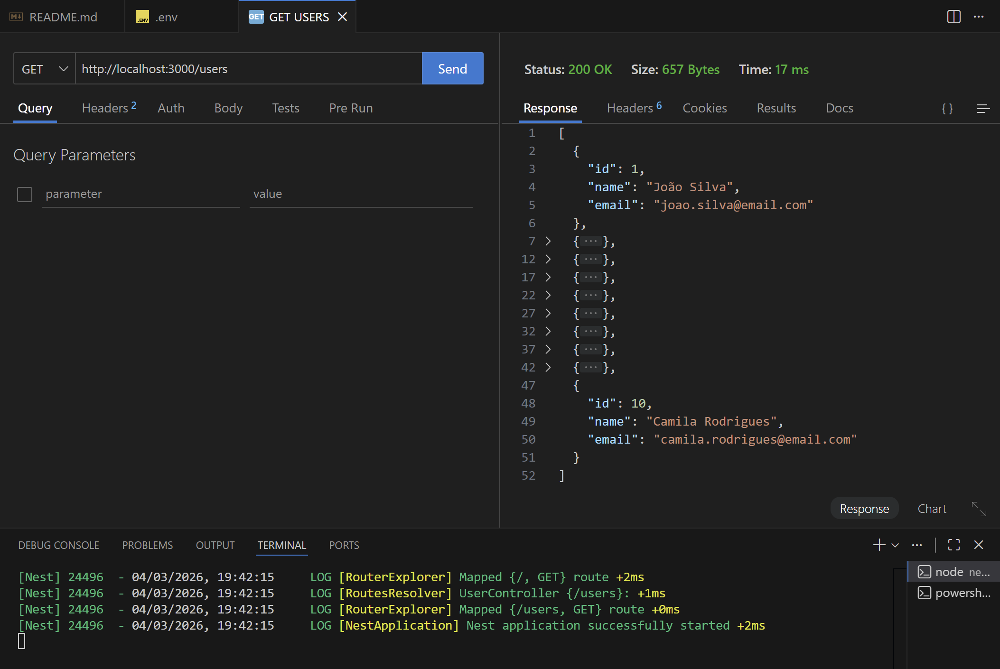

# Desafio 5

## Organização do projeto NestJS
Primeiramente, é importante salientar que foi utilizado o CLI do NestJS para criar a estrutura do projeto, como recomendado na documentação oficial. Além disso, essa CLI também foi utilizada para gerar o recurso `User` deste desafio. 

O comando utilizado para isso foi:
```bash
nest generate resource user
```

Esse comando cria a estrutura básica de um recurso, da seguinte forma:
```src
├─src
├── user
│   ├── dto
│   │   ├── create-user.dto.ts
│   │   └── update-user.dto.ts
│   ├── entities
│   │   └── user.entity.ts
│   ├── user.controller.ts
│   ├── user.controller.spec.ts
│   └── user.service.ts
│   └── user.service.spec.ts
```

Isso faz com que o backend fique organizado, com cada recurso tendo sua própria pasta. E dentro dela temos os arquivos de DTOs, entidade, controller e service, além dos arquivos de teste (*.spec.ts).

No root do projeto, temos os arquivos de configuração do NestJS:
```src
├── app.controller.ts
├── app.module.ts
├── app.service.ts
├── main.ts
```
O `app.module.ts` é o módulo raiz do projeto, onde importamos os outros módulos e configuramos a aplicação (ORM, ConfigModule, etc).

O `main.ts` é o ponto de entrada da aplicação, onde inicializamos o NestJS com NestFactory.

O `app.controller.ts` e o `app.service.ts` são arquivos gerados pelo CLI, mas não estão sendo utilizados nesse projeto, pois o foco é no recurso `User`.

Eu utilizei uma ORM para fazer a comunicação com o banco de dados. Eu não optei por simular o banco de dados com um array, pois queria simular um cenário mais realista, com o uso de migration.

Dessa forma, temos a seguinte arquitetura do projeto:
```bash
Controller -> Service -> Repository (TypeORM) -> Database (PostgreSQL)
```

## Como rodar a aplicação?
- Clonar o repositório e acessar a pasta do projeto.
- Instalar as dependências com o comando `npm install`.
- Certifique-se que o arquivo `.env` esteja configurado corretamente. Eu dei commit no meu arquivo `.env`
para facilitar o processo, mas pode configurá-lo como preferir. 
- Rodar o bando de dados com o comando `docker compose up -d` (certifique-se de ter o Docker instalado e rodando na sua máquina).
- Rodar as migrations para criar a tabela `user` no banco de dados com o comando `npm run migration:run`.
- Roder as seeds para popular a tabela `user` com o comando `npm run seed:run`.
- Rodar a aplicação com o comando `npm run start:dev`.

Por fim, para verificar o resultado do endpoint `GET /users`, basta rodar a aplicação com `npm run start:dev` e acessar `http://localhost:3000/users` no navegador ou utilizar uma ferramenta como o Postman/Thunder Client.

Aqui está a imagem do resultado do endpoint `GET /users` no Thunder Client:

<table align="center">
  <tr>
    <td align="center">
      
    </td>
  </tr>
</table>

## Explicação do user.service.ts

Neste arquivo é possível encontrar 3 funções: `create`, `findAll` e `findOne`.

A função `create` foi mantida para criar um novo usuário e ela foi utilizada no arquivo de seed (user.seed.ts) para popular a tabela `user` com alguns dados de teste.

A função `findAll` é responsável por retornar todos os usuários cadastrados no banco de dados. É essa função que o endpoint `GET /users` utiliza para retornar a lista de usuários.

Já a função `findOne` é responsável por retornar um usuário específico, baseado no ID fornecido. Ela já implemente uma lógica de validação para verificar a existência do usuário. Essa é uma função importante, pois sua reusabilidade dentro do próprio serviço é útil caso existisse o CRUD completo da entidade. Ela é utilizada no endpoint `GET /users/:id` para retornar um usuário específico, que não é o objetivo deste desafio, mas foi implementada para demonstrar a estrutura do serviço e a lógica de validação.


